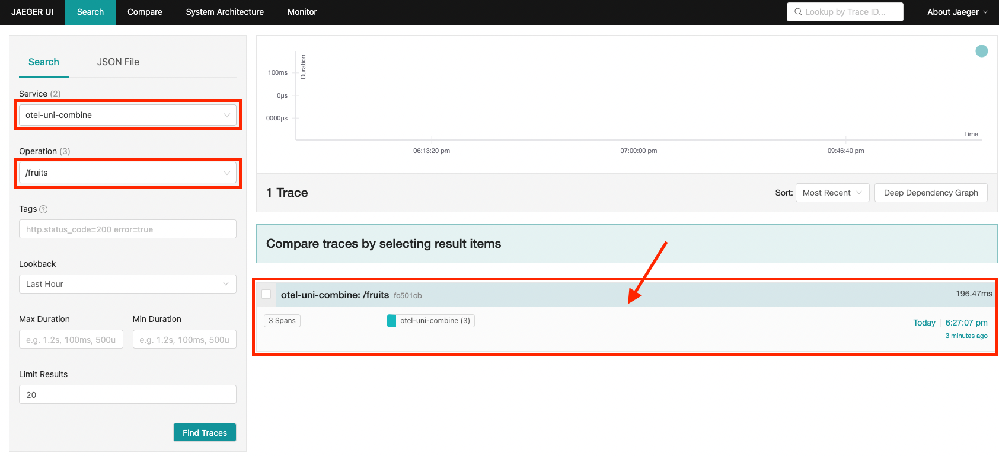
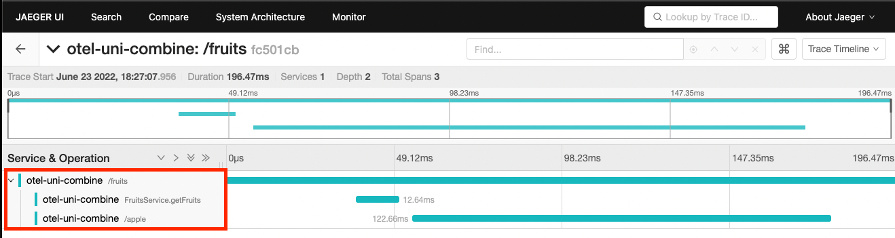

# otel-uni-combine Project

This project demonstrates an issue with OpenTelemetry with mutiny when combining Unis.

Steps to reproduce:
1. In a terminal, run `docker compose up` to start jaeger & otel-collector
2. In another terminal, run `quarkus dev` to start the app
3. Using some rest client (`curl`, `httpie`, postman, etc), invoke a `GET` to http://localhost:8080/fruits
4. Open the Jaeger UI at http://localhost:16686
5. In the Jaeger **Search** field, select the `otel-uni-combine` service
6. In the Jaeger **Operation**, select the `/fruits` operation
7. Click on the trace
   

8. Notice that the trace details only include the call to `/apple` and not to `/pear`. The trace is lost somewhere.
   
